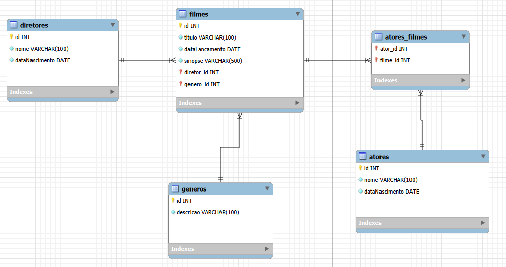
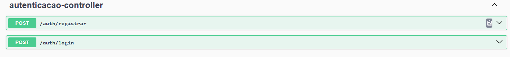
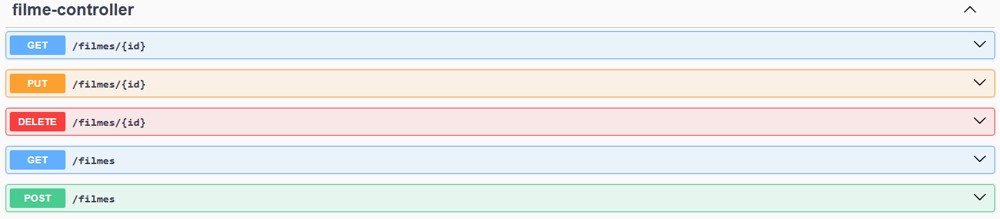
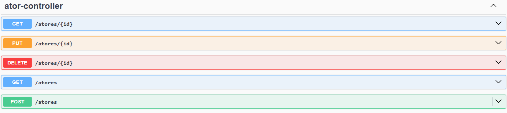
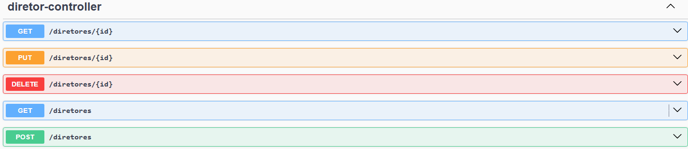
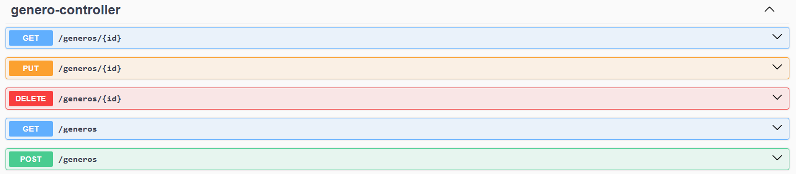

# API Filmes

API REST desenvolvida em Java com Spring Boot para cadastro e consulta de um catálogo de filmes. O projeto organiza o domínio em entidades como filmes, atores, diretores, gêneros e usuários, com suporte a autenticação e autorização via token JWT.

## Modelagem do banco de dados



## Visão geral

A aplicação permite realizar operações de criação, listagem, atualização e exclusão dos principais recursos do domínio:

- filmes
- atores
- diretores
- gêneros
- autenticação de usuários

O recurso de filmes é o centro da aplicação e se relaciona com diretor, gênero e elenco. Isso torna o projeto um bom exemplo de API com persistência relacional e modelagem de associações entre entidades.

## Tecnologias utilizadas

- Java 17
- Spring Boot 3.5
- Spring Web
- Spring Data JPA
- Spring Security
- JWT com `java-jwt`
- PostgreSQL
- OpenAPI / Swagger com `springdoc-openapi`

## Funcionalidades principais

- Cadastro e gerenciamento de filmes
- Cadastro e gerenciamento de atores, diretores e gêneros
- Registro e login de usuários
- Geração e validação de token JWT
- Proteção de rotas autenticadas
- Documentação interativa da API via Swagger

## Endpoints principais

- `POST /auth/registrar` - cria um novo usuário
- `POST /auth/login` - autentica e retorna um token
- `GET /filmes` - lista filmes
- `POST /filmes` - cadastra filme
- `GET /filmes/{id}` - busca filme por ID
- `PUT /filmes/{id}` - atualiza filme
- `DELETE /filmes/{id}` - remove filme
- `GET /atores`, `GET /diretores`, `GET /generos` - listagens dos demais recursos

## Como executar

1. Garanta que o PostgreSQL esteja em execução.
2. Crie o banco configurado no projeto.
3. Ajuste, se necessário, as credenciais em `src/main/resources/application.properties`.
4. Execute a aplicação com:

```bash
./mvnw spring-boot:run
```

No Windows, você também pode usar:

```bash
mvnw.cmd spring-boot:run
```

## Acesso à documentação

Com a aplicação em execução, a documentação Swagger fica disponível em:

- `/swagger-ui/index.html`

## Documentação dos endpoints

A interface do Springdoc / Swagger reúne os endpoints da aplicação e facilita a validação das rotas por recurso.

### Autenticação



### Filmes



### Atores



### Diretores



### Gêneros



## Estrutura do projeto

- `controller` - expõe os endpoints REST
- `service` - concentra as regras de negócio
- `repository` - acesso ao banco com JPA
- `model` - entidades persistidas
- `dto` - objetos de entrada e saída
- `security` - configuração de autenticação e filtros
- `exeption` - tratamento centralizado de erros

## Aprendizados envolvidos

Este projeto é um bom exercício prático de arquitetura em camadas e desenvolvimento de APIs modernas. Entre os principais aprendizados estão:

- construção de APIs REST com Spring Boot
- modelagem de relacionamentos entre entidades com JPA
- persistência em banco relacional com PostgreSQL
- uso de DTOs para entrada de dados
- tratamento centralizado de exceções
- criptografia de senha com BCrypt
- autenticação stateless com JWT
- configuração de segurança com Spring Security
- documentação automática de endpoints com OpenAPI

## Observação

O arquivo `application.properties` já aponta para um banco PostgreSQL local. Se o ambiente for diferente, será necessário ajustar a URL, o usuário e a senha antes de iniciar a aplicação.